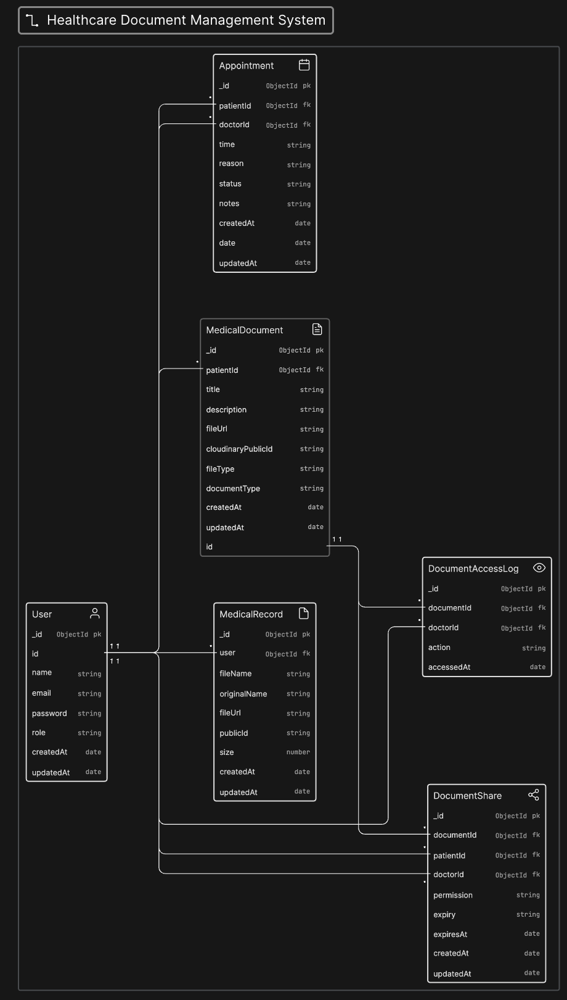
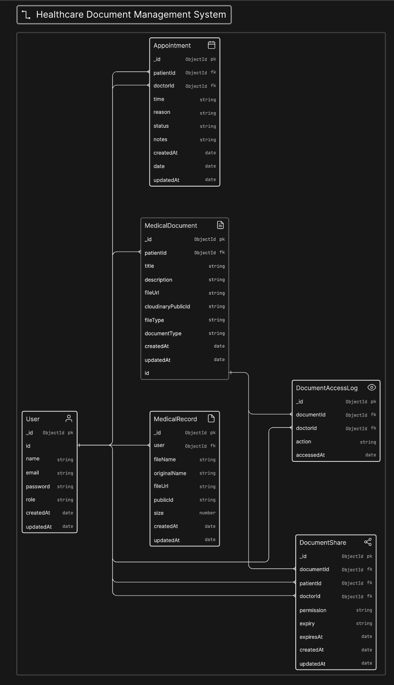

# System ER Diagram

This document contains the Entity-Relationship (ER) diagram for the system based on the implemented database models in the `backend/models` directory.

## System Architecture Diagram

## Enums

### `User.role`
| Value | Description |
|-------|-------------|
| `patient` | A registered patient on the system |
| `doctor` | A registered doctor on the system |

### `Appointment.status`
`Pending`, `Accepted`, `Rejected`, `Completed`, `Cancelled`

### `DocumentAccessLog.action`
`VIEW`, `DOWNLOAD`, `REVOKE`, `SHARE`

### `DocumentShare.permission`
`VIEW`, `DOWNLOAD`, `FULL_ACCESS`

### `DocumentShare.expiry`
`1H`, `24H`, `7D`, `NEVER`
