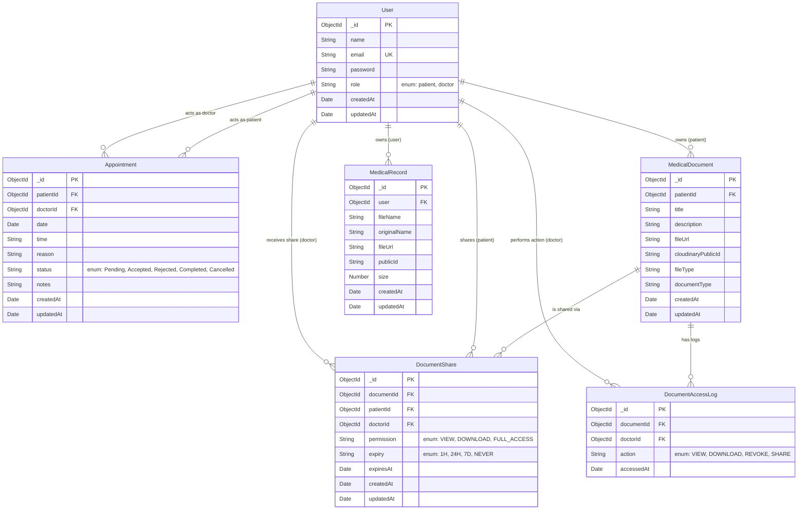
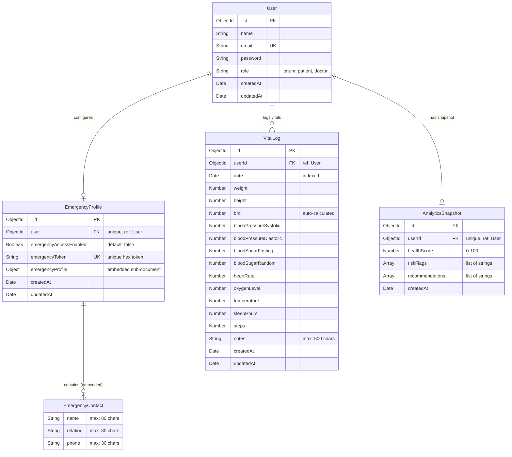
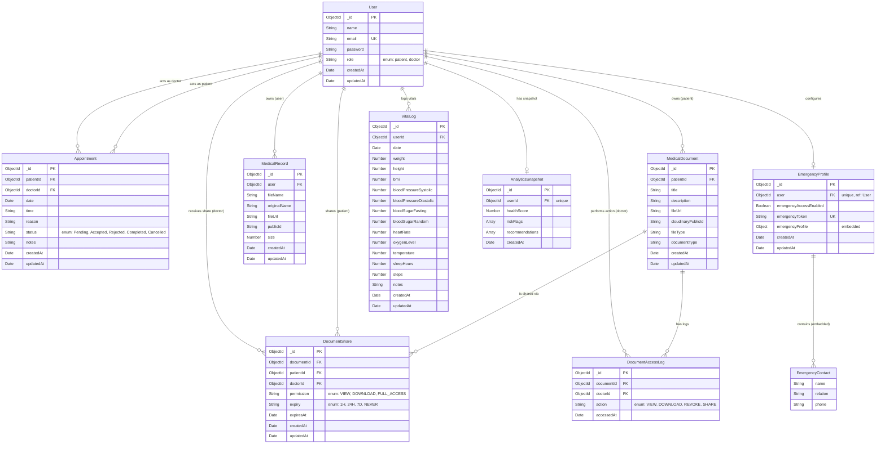

# System ER Diagram

This document contains the Entity-Relationship (ER) diagram for the system based on the implemented database models in the `backend/models` directory.

---

## Part 1 — Original Entities (First Half)

---

## Part 2 — New Entities (Second Half Update)

The following three entities were introduced in the second half of the project to support **Emergency Access**, **Vitals Tracking**, and **Health Analytics**.

> **Note:** `EmergencyContact` is an embedded sub-document within the `emergencyProfile` field of `EmergencyProfile`. It does not have its own MongoDB collection. The `emergencyProfile` field also contains: `fullName`, `age`, `bloodGroup`, `allergies[]`, `conditions[]`, `medications[]`, and `notes`.

---

## Complete ER Diagram (All Entities Combined)

---

## System Architecture Diagram

---

## Enums

### `User.role`
| Value | Description |
|-------|-------------|
| `patient` | A registered patient on the system |
| `doctor` | A registered doctor on the system |

### `Appointment.status`
`Pending`, `Accepted`, `Rejected`, `Completed`, `Cancelled`

### `DocumentAccessLog.action`
`VIEW`, `DOWNLOAD`, `REVOKE`, `SHARE`

### `DocumentShare.permission`
`VIEW`, `DOWNLOAD`, `FULL_ACCESS`

### `DocumentShare.expiry`
`1H`, `24H`, `7D`, `NEVER`

---

## New Relationships Summary (Second Half)

| From Entity | To Entity | Cardinality | Verb |
|-------------|-----------|-------------|------|
| User | EmergencyProfile | 1 : 0..1 | configures |
| EmergencyProfile | EmergencyContact | 1 : 0..N | contains (embedded array) |
| User | VitalLog | 1 : 0..N | logs vitals |
| User | AnalyticsSnapshot | 1 : 0..1 | has snapshot (cached) |
